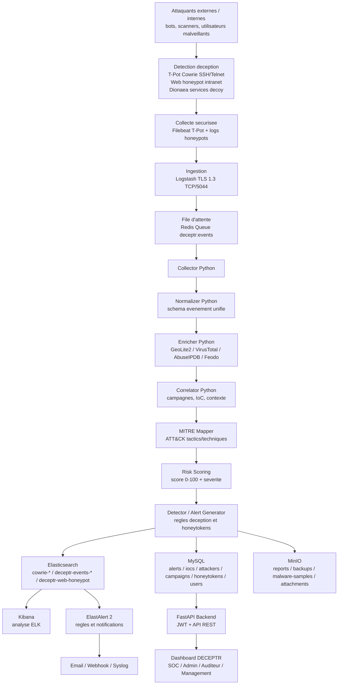

# Architecture Fonctionnelle - DECEPTR v1 MVP

Version mise a jour: 2026-06-15. Cette architecture correspond au projet final valide dans `D:\assir\Ismagi\PFA\DECEPTR-FINAL`.

## Objectif

DECEPTR est une plateforme de cyberdeception qui attire les attaquants vers des services leurres, collecte leurs actions, enrichit les evenements avec du renseignement, detecte les comportements suspects, puis expose les resultats au SOC via dashboard, API, Kibana et rapports.

## Schema fonctionnel

## Couches fonctionnelles

| Couche | Role | Services du projet |
|---|---|---|
| 1. Detection | Capturer connexions, commandes, identifiants, acces documents et probes | Cowrie, web honeypot, Dionaea, canary tokens |
| 2. Collecte | Lire les logs Cowrie et acheminer les evenements | `deceptr-tpot-forwarder`, Filebeat |
| 3. Traitement initial | Parser et securiser l'entree vers le pipeline | `deceptr-logstash`, TLS 1.3 |
| 4. File d'attente | Eviter la perte d'evenements et decoupler ingestion/analyse | `deceptr-redis` |
| 5. Normalisation | Transformer chaque source en schema DECEPTR commun | `normalizer.py` |
| 6. Renseignement | Ajouter geo, reputation, C2, MITRE et contexte | `enricher.py`, `correlator.py` |
| 7. Detection | Declencher alertes, scoring, honeytokens, campagnes | `detector.py`, `risk_scorer.py` |
| 8. Stockage | Conserver preuves, alertes, IoC et rapports | Elasticsearch, MySQL, MinIO |
| 9. Visualisation | Exploiter les donnees operationnelles | Dashboard, Kibana, API Docs |
| 10. Alerting | Notifier incidents critiques et hauts risques | ElastAlert 2, alerter pipeline |

## Flux de donnees valides

| ID | Flux | Etat valide |
|---|---|---|
| F1 | Cowrie SSH/Telnet -> cowrie.json | OK, T-Pot runtime actif |
| F2 | Filebeat -> Logstash `5044` | OK, TLS 1.3 teste |
| F3 | Logstash -> Redis | OK, queue `deceptr:events` |
| F4 | Redis -> Pipeline | OK, collector consomme les evenements |
| F5 | Pipeline -> Elasticsearch | OK, index `deceptr-events-2026.06` |
| F6 | Pipeline -> MySQL | OK, alertes, IoC, campagnes, honeytokens |
| F7 | Web honeypot -> Elasticsearch | OK, index `deceptr-web-honeypot` |
| F8 | Canary API -> Redis -> Pipeline | OK, alerte CRITICAL MITRE `T1039` |
| F9 | API -> Dashboard | OK, login JWT et stats dashboard |
| F10 | Elasticsearch -> Kibana | OK, Kibana accessible |

## Acteurs

| Acteur | Utilisation |
|---|---|
| SOC Analyst | Surveiller alertes, IoC, campagnes et sessions honeypot |
| Administrateur | Lancer, arreter, configurer les services et secrets |
| Auditeur | Consulter preuves, rapports DGSSI et historique |
| Management | Lire indicateurs, tendance, risque et synthese |

## Couverture validee

Le test E2E du 2026-06-15 a confirme: Cowrie actif, TLS 1.3, index brut `cowrie-2026.06`, index enrichi `deceptr-events-2026.06`, mapping MITRE `T1110`, API alertes fonctionnelle, et honeytoken critique `T1039`.
