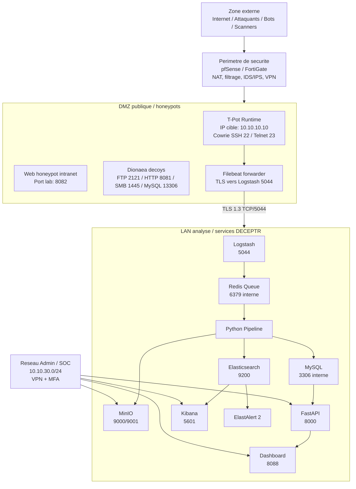

# Architecture Reseau - DECEPTR v1 MVP

Version mise a jour: 2026-06-15. Cette vue decrit les zones, flux autorises et ports reels du projet final.

## Schema reseau logique

## Zones reseau

| Zone | Role | Exemple theorique |
|---|---|---|
| Zone externe | Source des attaques et scans | Internet |
| Perimetre | NAT, filtrage, IDS/IPS, VPN | pfSense / FortiGate |
| DMZ | Honeypots exposes et leurres | `10.10.10.0/24` |
| LAN analyse | Traitement, stockage, alerting | `10.10.20.0/24` |
| Admin / SOC | Acces securise aux dashboards | `10.10.30.0/24` |

## Ports exposes en environnement actuel

| Service | Port hote | Port conteneur | Role |
|---|---:|---:|---|
| Cowrie SSH | 22 | 2222/22 selon runtime | Honeypot SSH |
| Cowrie Telnet | 23 | 2223/23 selon runtime | Honeypot Telnet |
| Logstash Beats | 5044 | 5044 | Ingestion TLS 1.3 |
| Dashboard DECEPTR | 8088 | 80 | Interface SOC |
| API FastAPI | 8000 | 8000 | API REST/JWT |
| Kibana | 5601 | 5601 | Dashboard ELK |
| Elasticsearch | 9200 | 9200 | API ES locale |
| Web honeypot | 8082 | 8080 | Faux portail intranet |
| Dionaea FTP | 2121 | 21 | Decoy FTP |
| Dionaea HTTP | 8081 | 80 | Decoy HTTP |
| Dionaea SMB | 1445 | 445 | Decoy SMB, evite conflit Windows 445 |
| Dionaea MySQL | 13306 | 3306 | Decoy MySQL, evite conflit local 3306 |
| MinIO API/Console | 9000/9001 | 9000/9001 | Stockage objet |
| Redis | 6379 | 6379 | Queue technique |

## Flux autorises

| ID | Emetteur | Recepteur | Protocole / Port | Sens | Justification |
|---|---|---|---|---|---|
| R1 | Internet | Cowrie | TCP 22, 23 | entrant | Capturer SSH/Telnet |
| R2 | Internet/lab | Web honeypot | TCP 8082 | entrant | Faux portail intranet |
| R3 | Internet/lab | Dionaea | TCP 2121, 8081, 1445, 13306 | entrant | Services decoy |
| R4 | T-Pot Filebeat | Logstash | TCP 5044 TLS 1.3 | DMZ -> LAN | Envoi logs securise |
| R5 | Logstash | Redis | TCP 6379 interne | interne | Queue d'evenements |
| R6 | Pipeline | Elasticsearch | TCP 9200 | interne | Indexation brute/enrichie |
| R7 | Pipeline/API | MySQL | TCP 3306 interne | interne | Donnees metier |
| R8 | Pipeline/API | MinIO | TCP 9000 | interne | Objets, rapports, fichiers |
| R9 | SOC/Admin | Dashboard/API/Kibana/MinIO | TCP 8088/8000/5601/9001 | VPN/admin | Exploitation et investigation |

## Regles de securite recommandees

- Exposer en production seulement les honeypots en DMZ.
- Limiter `5044` a l'adresse IP du serveur T-Pot ou au VPN.
- Garder Elasticsearch, MySQL, Redis et MinIO API non publics.
- Mettre Dashboard, Kibana et API derriere VPN, MFA et filtrage IP.
- Isoler physiquement ou virtuellement la DMZ du LAN analyse.
- Surveiller les sorties du honeypot pour eviter toute reutilisation offensive.

## Validation reseau

Les tests du 2026-06-15 ont confirme les ports ouverts et services actifs: `22`, `23`, `2121`, `1445`, `13306`, `5044`, `5601`, `8000`, `8081`, `8082`, `8088`, `9000`, `9001`, `9200`. Filebeat a valide `parse host`, `dns lookup`, `dial up`, `TLS version: TLSv1.3`, et `talk to server`.
