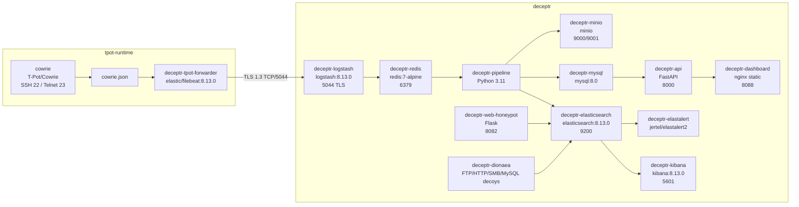

# Architecture Technique - DECEPTR v1 MVP

Version mise a jour: 2026-06-15. Cette vue detaille les composants deployes, les fichiers importants, les ports et l'etat valide.

## Schema technique Docker



## Services actifs

| Conteneur | Role | Etat attendu |
|---|---|---|
| `cowrie` | Honeypot SSH/Telnet T-Pot runtime | running |
| `deceptr-tpot-forwarder` | Filebeat Cowrie vers Logstash | TLS 1.3 OK |
| `deceptr-logstash` | Ingestion et parsing | Up |
| `deceptr-redis` | Queue anti-perte | healthy |
| `deceptr-pipeline` | Pipeline 7 etapes | Up |
| `deceptr-elasticsearch` | Stockage logs/evenements | healthy |
| `deceptr-mysql` | Stockage metier | healthy |
| `deceptr-minio` | Stockage objet | healthy |
| `deceptr-kibana` | Visualisation ELK | Up |
| `deceptr-api` | API REST JWT | Up |
| `deceptr-dashboard` | Dashboard SOC | Up |
| `deceptr-elastalert` | Alerting regles | Up |
| `deceptr-web-honeypot` | Faux portail intranet | Up |
| `deceptr-dionaea` | Decoys reseau | Up |

## Pipeline Python

| Etape | Module | Fonction |
|---|---|---|
| 1 | `collector.py` | Lit Redis `deceptr:events`, fallback Elasticsearch `cowrie-*` |
| 2 | `normalizer.py` | Convertit Cowrie/canary en schema commun |
| 3 | `enricher.py` | Ajoute GeoLite2, AbuseIPDB, VirusTotal, Feodo |
| 4 | `correlator.py` | Associe contexte, campagne et MITRE |
| 5 | `risk_scorer.py` | Calcule score 0-100 |
| 6 | `detector.py` | Declenche regles `login_attempt`, `honeytoken_triggered`, web login |
| 7 | `storage.py` / `alerter.py` | Ecrit ES/MySQL/MinIO et notifie |

## Index Elasticsearch

| Index | Source | Role |
|---|---|---|
| `cowrie-YYYY.MM` | Logstash | Logs bruts Cowrie |
| `deceptr-events-YYYY.MM` | Pipeline | Evenements normalises, enrichis, scores |
| `deceptr-web-honeypot` | Web honeypot | Acces faux portail, login, documents |

Etat constate apres test: `cowrie-2026.06`, `deceptr-events-2026.06`, `deceptr-web-honeypot`.

## Tables MySQL

| Table | Role |
|---|---|
| `users` | Utilisateurs API/dashboard |
| `alerts` | Alertes generees |
| `iocs` | Indicateurs par IP |
| `attackers` | Identifiants/commandes observes |
| `campaigns` | Regroupement par IP et techniques |
| `honeytokens` | Canary tokens declenches |
| `rapports_dgssi` | Historique des rapports |

## Fichiers importants

| Fichier / Dossier | Role |
|---|---|
| `start.ps1` | Demarrage complet depuis le dossier final |
| `stop.ps1` | Arret sans suppression de donnees |
| `deceptr/docker-compose.yml` | Services principaux DECEPTR |
| `deceptr/docker-compose.tpot.yml` | Integration T-Pot/Filebeat |
| `deceptr/elk/certs/ca.crt` | CA pour Filebeat -> Logstash TLS |
| `deceptr/pipeline/data/GeoLite2-City.mmdb` | Base GeoLite2 locale |
| `deceptr/scripts/e2e-smoke.ps1` | Test complet Cowrie -> dashboard/API |
| `deceptr/honeypot-web/` | Faux portail intranet actif |
| `deceptr/dionaea/` | Fichiers leurres et decoys |

## Commandes de verification

```powershell
cd D:\assir\Ismagi\PFA\DECEPTR-FINAL
powershell -ExecutionPolicy Bypass -File .\start.ps1

cd D:\assir\Ismagi\PFA\DECEPTR-FINAL\deceptr
docker compose -f docker-compose.yml -f docker-compose.tpot.yml ps
docker exec deceptr-tpot-forwarder filebeat test output -e --strict.perms=false
powershell -ExecutionPolicy Bypass -File .\scripts\e2e-smoke.ps1 -ProjectRoot . -TpotRoot ..\tpot-runtime -WaitSeconds 45
```

## Resultat de validation

```json
{
  "status": "OK",
  "tpot_cowrie": "running",
  "tpot_forwarder_tls": "TLSv1.3",
  "raw_index": "cowrie-2026.06",
  "enriched_index": "deceptr-events-2026.06",
  "enriched_type": "login_attempt",
  "mitre": "T1110",
  "api_total_alerts": 161,
  "api_alerts_24h": 80
}
```

## Points physiques restants

La partie logique est complete en Docker/lab. En production, il reste a deployer physiquement: DMZ reelle, pare-feu pfSense/FortiGate, IPs `10.10.10.0/24`, `10.10.20.0/24`, `10.10.30.0/24`, VPN/MFA admin, SMTP reel, et cles API threat intelligence officielles.
